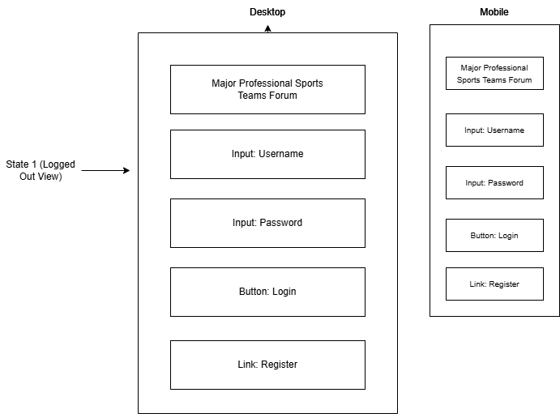
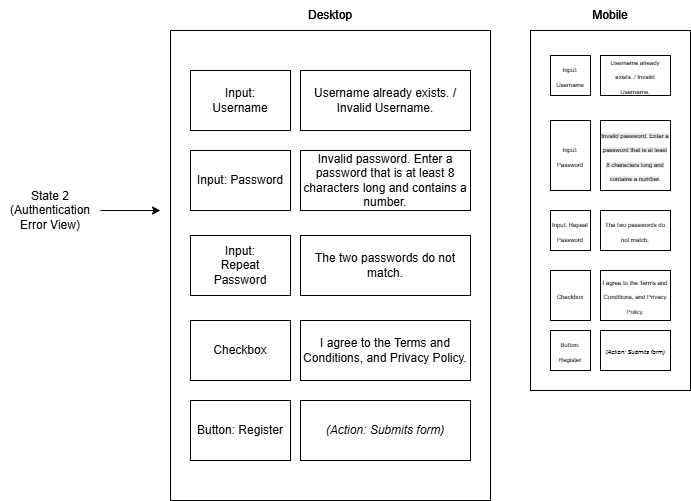
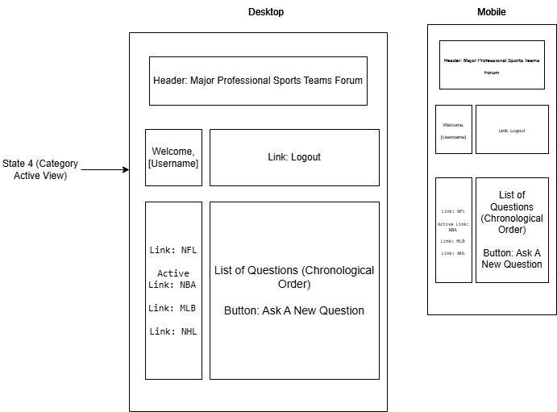
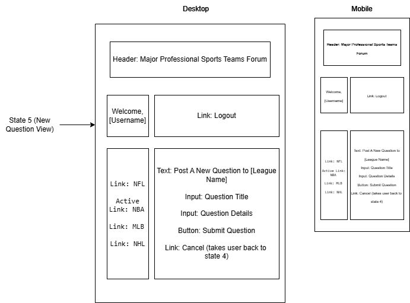

# Lee Samuel

## Project Name:

Major-Professional-Sports-Teams-Forum

## Project Description:

- **Major Professional Sports Teams Forum** is a robust, 3-tier full-stack application built with **React**, **Vite**, and **TheSportsDB API**. Designed for high-stakes sports commentary and real-time fan engagement, the platform provides a centralized hub for users to discuss their favorite professional teams across various leagues.

- The application features a secure architecture and a responsive user interface, allowing sports enthusiasts to join threads, post replies, and interact within dedicated community spaces.

## View Online

- [Live Demo Link] https://lsamuel-dev.github.io/Major-Professional-Sports-Teams-Forum/
- [GitHub Repository] https://github.com/lsamuel-dev/Major-Professional-Sports-Teams-Forum/

## Project Structure

/major-sports-forum
├── /public (Static assets)
├── /src
│ ├── /components (Login, TeamCard, ForumThread, CommentCard)
│ ├── App.jsx (Main entry and state management)
│ ├── main.jsx
│ └── index.css
├── package.json
└── vite.config.js

### Key Features

- **Decoupled Architecture:** A sophisticated frontend system utilizing React for UI and state, integrated with a dynamic REST API for real-time team data.

- **Data Persistence:** Implemented `localStorage` synchronization to ensure that user sessions and community discussions remain persistent across browser reloads.

- **Role-Based Authorization:** A secure logic layer that identifies the post author and restricts "Delete" privileges to the original creator, featuring a custom "YOU" badge.

- **Responsive User Interface:** A seamless, mobile-friendly design ensuring a consistent experience across all devices.

## User Stories

1. **As a visitor**, I want to browse different sports categories like NFL, NBA, MLB, and NHL, so that I can easily find discussions related to my favorite leagues.
   - **Acceptance Criteria:** - The homepage displays clear navigation links for each major league.
     - Clicking a category filters and displays only the teams associated with that league.

2. **As a visitor**, I want to search for specific team names so that I can quickly find relevant conversations.
   - **Acceptance Criteria:** - A search functionality is integrated into the league filtering view.
     - The list of teams updates dynamically based on the user's input.

3. **As a visitor**, I want to create a secure account with a unique username so that I can participate in the community.
   - **Acceptance Criteria:** - The registration form validates and saves the user identity to the application state.

4. **As a registered user**, I want to log in to my account securely so that my personal profile is protected.
   - **Acceptance Criteria:** - Successful authentication redirects the user to the main forum dashboard.

5. **As a member**, I want to start a new discussion thread within a specific team so that I can share my insights.
   - **Acceptance Criteria:** - An "Add Comment" interface is available to authenticated users within team threads.

6. **As a member**, I want to reply to existing threads so that I can engage in real-time debates.
   - **Acceptance Criteria:** - Submitted replies appear instantly in the thread with the user's name and a timestamp.

7. **As a user**, I want to access the forum from both my phone and desktop so that I can stay engaged on the go.
   - **Acceptance Criteria:** - The UI layout automatically adjusts for screen sizes below 768px.

8. **As a member**, I want my session to remain active after a refresh so that I stay logged in.
   - **Acceptance Criteria:** - The application utilizes `localStorage` to check for an existing session on mount.

9. **As an author**, I want to delete my own posts if they are no longer relevant so that the forum remains high-quality.
   - **Acceptance Criteria:** - The "Delete" button only renders if the `currentUser` matches the `comment.author`.

## Wireframe Diagrams

- 
- 
- 
- 
- 

## State Tree

App State
├── user (string: current logged-in username)
├── teams (array: fetched from TheSportsDB)
├── selectedTeam (object: active team data)
├── loading (boolean: API fetch status)
└── allComments (object: keyed by teamId containing comment arrays)
    ├── id (number: timestamp)
    ├── text (string)
    ├── author (string)
    └── timestamp (string)

## Component List

- **Container Components:** App, Login, TeamList, ForumThread.
- **Presentational Components:** NavBar, TeamCard, CommentCard, CommentForm, LogoutButton.

## Technologies Used

- **React (v19):** UI and State Management.
- **Vite:** Development Environment.
- **TheSportsDB API:** Dynamic Data Source.
- **LocalStorage API:** Data Persistence.
- **CSS3:** Responsive Layouts.

## Installation Instructions

1. **Clone the repository:** `git clone https://github.com/lsamuel-dev/Major-Professional-Sports-Teams-Forum.git`

2. **Install dependencies:** `npm install`

3. **Run the development server:** `npm run dev`

4. **Deploy:** `npm run deploy`
